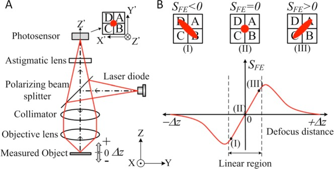

# 🔬 Patterning and Lithography

> Detailed information about patterning and lithography techniques for semiconductor fabrication.

## Overview

This section covers various patterning techniques including DIY approaches using repurposed consumer electronics and professional-grade equipment setups.

## DIY Blu-Ray Lithography (Spinner)

### Capabilities
- **Resolution**: Down to 500 nm
- **Technology**: Blu-ray laser (405 nm wavelength)
- **Components**: Sled and spindle motors for high-precision positioning
- **Dual-purpose**: Motors used for both spin-coating and laser writing

### Safety Considerations
- **Eye Protection**: Wear UV-blocking safety glasses ([Amazon Safety Glasses](https://www.amazon.com/Tool-Klean-Safety-Glasses-Protection/dp/B081BHTJT8))
- **Environment**: Avoid reflective surfaces and be cautious with laser direction
- **Resources**: [Laser Pointer Forums](https://laserpointerforums.com/) for safety guidelines
- **Equipment Sources**: DVD players from RJTECH, laptops, PCs, or Wii consoles can be repurposed

### Technical Concepts

#### Key Components
- **OPU (Optical Pickup Unit)**: Reads/writes discs and provides laser and focus mechanisms
- **Rayleigh Criterion**: Defines smallest resolvable feature size ([YouTube Explanation](https://www.youtube.com/watch?v=sTa-Hn_eisw))
- **Astigmatic Focus Method**: Uses ABCD photodiode signals; (A+C) - (B+D) = 0 when focused
- **Focus Matching**: Laser must focus through a layer similar to disc's polycarbonate; use microscope cover glass

#### Operational Parameters
- **Writing Pattern**: Concentric circles (disc-like configuration)
- **Motion Control**: Calculate step count for radial motion
- **Feedback**: Closed-loop control possible using reference marks on substrate
- **Size Constraints**: 
  - Inner radius = 23 mm
  - Outer radius = 58 mm
- **Speed Considerations**: Spin speed affects exposure; too fast results in underexposure

### Documentation and Resources
- [HackerFab Documentation](https://docs.hackerfab.org/home/fab-toolkit/patterning/blu-ray-lithography/lithography-spinner-v1/documentation)
- [DIY Youware Post](http://www.diyouware.com/node/161)
- [PMC Blu-ray Litho Study](https://pmc.ncbi.nlm.nih.gov/articles/PMC6066758/)
- [YouTube: DoctorVolt, Edwin Hwu](https://www.youtube.com/watch?v=liGuhbFh4IQ)

## Stepper System

### Overview
Projects entire pattern onto photoresist via DLP projector and optical lens system.

### Hardware Components
- **Projector**: DLPDLCR230NPEVM ($299)
- **Camera**: C-mount (~$200) for alignment and focus
- **Optics**: Thor Labs components and micrometers for mechanical adjustment
- **Motion**: Motors drive micrometers for positioning

### Setup Requirements
- Ensure projector forms converging image
- Focus using microscope objective lens
- **XY Stage**: Closed-loop system with linear optical encoders and stepper motors with planetary gear sets
- **Wavelength**: Ensure projector emits appropriate UV; use filters if needed

### System Evolution

#### Stepper V1/V2/V2.1 Improvements
- **Design Change**: Moved from vertical microscope to custom ThorLabs optical path
- **Components**: Beam splitters, filter mounts, tube lenses, 10x objectives
- **Equipment**: ViewSonic PX-701 4K projector + Amscope MU2003-BI camera
- **References**: 
  - [Zeloof Maskless Lithography](http://sam.zeloof.xyz/maskless-photolithography/)
  - [YouTube: Huygens Optics](https://www.youtube.com/watch?v=_w0Z2Y5vaAQ)

## Mask Design with K-Layout

### Software Usage
Used to design precise lithographic patterns with key layers:
- **Substrate**: Silicon base
- **Poly**: Polysilicon gates
- **Active**: Transistor regions
- **Contact**: Interconnect vias
- **Aluminum**: Metal routing

### Export Options
- Python scripts
- Screenshots
- Designs must match optical resolution of projector

## Feature Size Optimization

### Improvement Techniques
- **Optics**: Use binocular or UV-coated lenses to reduce projected image size
- **Materials**: High-sensitivity photoresists and blue filters for wavelength matching
- **System**: Image reduction optics (Projector → Lens → Small pattern on photoresist)
- **Components**: Curved lenses from binoculars can be repurposed

### Current Capabilities
- **Feature Size**: ~300-500 µm achievable
- **Exposure Time**: 5-15 minutes
- **Pattern Area**: Multiple square inches

## Projector Analysis: RCA RPJ104

### Specifications
| Feature | Specification | Lithography Impact |
|---------|---------------|-------------------|
| Brightness | 2000 lumens | Shortens exposure time |
| Resolution | 480p | Limits minimum feature size (~300-500 µm) |
| Input | 1080p via HDMI | Useful for control, not resolution improvement |
| Contrast | 2000:1 | Affects edge sharpness |
| Image Size | Up to 150" | Affects optical working distance |
| Display Tech | LCD | Optical behavior of image |
| Power | ~2W | Heat and cooling concerns |

### Product Links
- [LegendMicro](https://legendmicro.com/rca-rpj104-1080p-android-wi-fi-rojector.html)
- [Amazon Canada](https://www.amazon.ca/CURTIS-INTERNATIONAL-RPJ104-Lumens-Projector/dp/B07LGHTQTX?th=1)

## System Limitations and Solutions

### Brightness Constraints
**Issues**: Limited light output
**Solutions**:
- Use fresnel lenses to focus more light
- Choose photoresists optimized for visible light
- Add photosensitizers to resists
- Work in dark environments with external cooling fans

### Resolution Constraints
**Issues**: Limited by projector resolution
**Solutions**:
- Design for larger features
- Use reduction optics (trades off exposure area)
- Consider multi-pass exposures

### Focus Constraints
**Issues**: Projector focus limitations
**Solutions**:
- Add external lenses for closer focus
- Optimize working distance
- Use small apertures or ensure flat substrate

### Wavelength Constraints
**Issues**: Mismatch with photoresist sensitivity
**Solutions**:
- Add blue light filter
- Use photoresists sensitive to visible light
- Consider pre-exposure processing

### Contrast and Image Quality
**Issues**: Poor edge definition
**Solutions**:
- Preprocess patterns for high contrast
- Consider mask layers for dark regions
- Adjust development timing

### Thermal Management
**Issues**: Projector overheating
**Solutions**:
- Use fans, heat sinks, duty cycles
- External cooling systems

### Vibration Control
**Issues**: Movement during exposure
**Solutions**:
- Use isolation platforms
- Rigidly mount components
- Disable projector fan during exposures if externally cooled

## Recommended Setup

### 1. Optical System
- Add fresnel lens + blue filter
- Set proper projector distance

### 2. Environment
- Vibration-isolated platform
- Darkroom setup
- External cooling

### 3. Process
- Start with larger features
- Use visible-light resists
- Allow long exposure times

### 4. Software
- Preprocess pattern images
- Test with resolution targets

## Imaging Tutorial

### Pattern Types
- **Exposure Pattern**: Pure blue for exposed areas, black elsewhere; include alignment marks
- **Red Align Image**: Pure red except for marks that align with previous layer
- **UV Focus Pattern**: Pure black except for blue focus marks (grayscale optional)

### Guidelines
- Focus marks should sit in fully exposed regions
- Reference: [Stepper V2 Build Guide](https://docs.hackerfab.org/home/fab-toolkit/patterning/lithography-stepper-v2-build-work-in-progress)

---
[← Back to Home](README.md)
