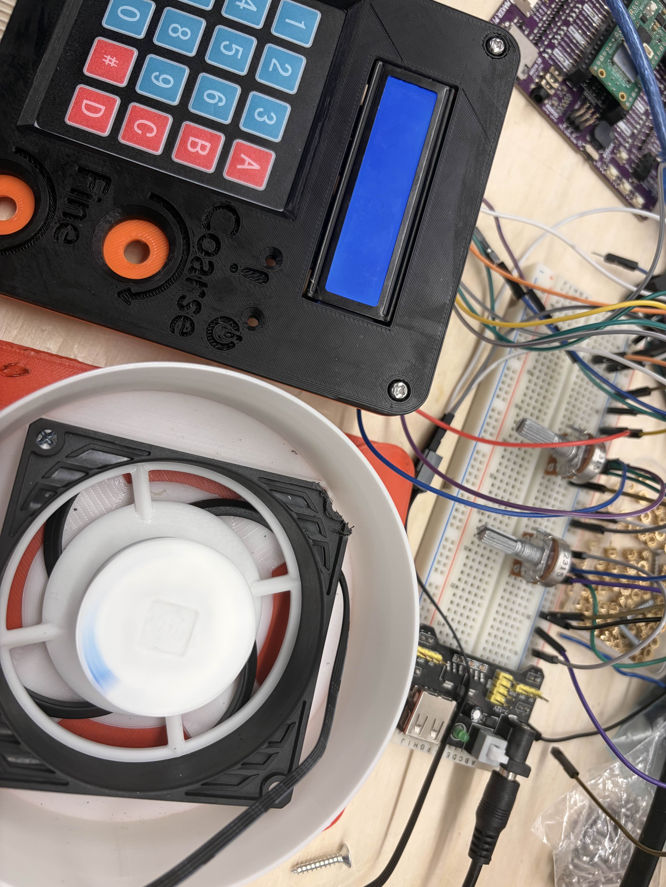
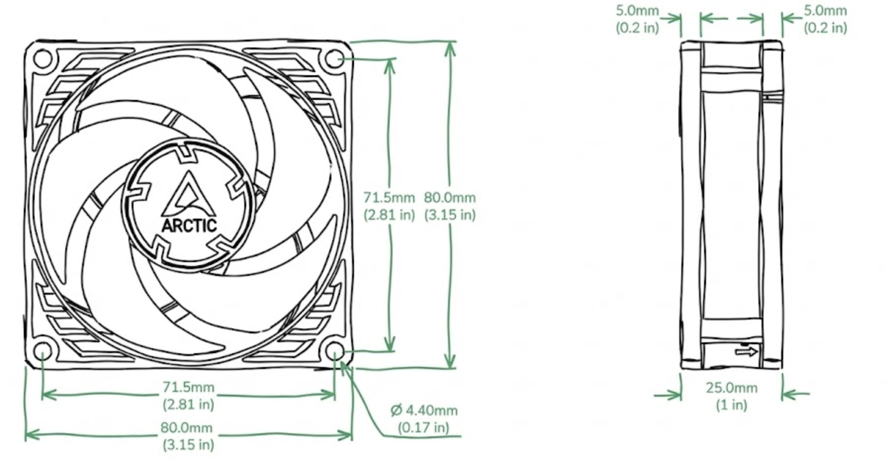
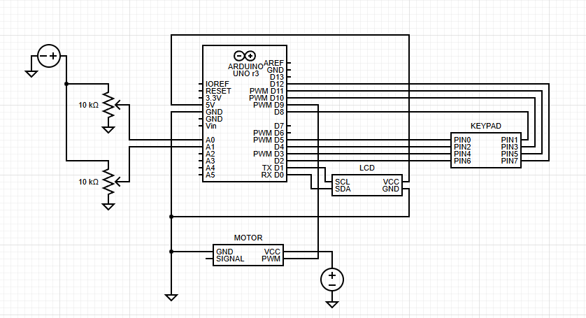

# High-Speed Spin Coater Build

  

A precise, uniform spin coater is an absolute necessity for integrated circuit fabrication. It is used to deposit perfectly flat, micro-thin layers of liquid chemicals—such as spin-on dopants and photoresist—across the entire surface of a silicon wafer. Our custom DIY spin coater leverages modified off-the-shelf PC cooling components driven by an Arduino micro-controller to achieve stable, repeatable spins ranging from 600 to 3000 RPM.

## Engineering & Design Overview
- **Substrate Capacity:** Engineered to securely hold silicon substrates and test dies up to 50mm in diameter via a custom chuck.
- **Programmable Operation Time:** Features user-programmable job durations ranging from 1 to 300 seconds for varied chemical viscosities.
- **Precision Speed Control:** Utilizes granular Pulse Width Modulation (PWM) control featuring both coarse adjustments (for macro target-setting) and fine adjustments (for precise RPM targeting).

## Comprehensive Bill of Materials (BOM)
* **Drive Motor:** Arctic P8 Max 12 V PC fan (heavily modified to act as the direct-drive spindle).
* **Micro-Controller:** Arduino Uno.
* **User Interface:** I2C 1602 LCD module display, 4×4 membrane keypad.
* **Analog Controls:** Dual 10 kΩ rotary potentiometers (designated for Coarse and Fine speed adjustment).
* **Power Supply:** 12 V DC brick supply (Minimum 0.5 A rating, ideally higher for torque overhead).
* **Power Switching:** Logic-level MOSFET or standard motor driver module (e.g., L298N).
* **Structural Components:** Custom 3D-printed splash housing and sample chuck.

## Detailed Build Process

### 1. Drive Motor Modification (The Arctic P8 Max)
PC fans are incredibly well-engineered, high-RPM brushless DC motors available at extremely low cost, making them perfect for this application. However, they must be modified drastically.
- **Disassembly:** Carefully pop the fan hub off the stator frame. Remove or snap off all the aerodynamic fan blades, as we only need the central hub.
- **Resurfacing:** The top of the motor cap is usually rounded or features a sticker indent. It must be sanded completely flat and perfectly level. Any tilt or unevenness will induce serious vibrations at 3000 RPM, ruining the chemical deposition and potentially firing the silicon die across the room.

  

### 2. Enclosure & Wafer Chuck Assembly
Chemicals used in fabrication (like HF, resists, and dopants) are hazardous. The enclosure serves as both a structural mount and a splash guard.
- **Housing Print:** Print the 3D housing—inspired by BirdBrain's DIY design—using a chemical-resistant filament (like PETG or ABS). The housing must fully encapsulate the electronics underneath while providing a "catch basin" for any chemicals spun off the wafer.
- **Chuck Mounting:** Attach your custom 3D printed vacuum or friction chuck to the flattened motor cap. Ensure it is perfectly centered. Use a high-strength epoxy or precision mounting hardware.

### 3. Circuitry & Arduino Logic Integration
The system requires a robust power delivery method and precise logic control to operate safely.
- **Motor Power Delivery:** The Arduino cannot power the motor directly. Connect the 12V DC power supply to the MOSFET/motor driver. The driver will take the heavy load of the motor, while waiting for a low-power PWM logic signal from the Arduino to dictate speed.
- **Analog Inputs:** Wire the two 10k potentiometers to the Arduino's analog input pins. In code, map the primary (coarse) potentiometer to cover the full range of 0-255 PWM (giving you broad control over the 600-3000 RPM range). Map the secondary (fine) potentiometer to a much smaller window (e.g., ±5%) to let the user dial in the exact target RPM.

  

### 4. User Interface (UI) Implementation
A clear and responsive UI is necessary so the operator doesn't have to guess the RPM or manually time the spin duration with a stopwatch.
- **Hardware Integration:** Connect the 4x4 membrane keypad and the 1602 LCD (using the I2C backpack) to the Arduino. I2C is highly recommended as it only requires 4 pins (VCC, GND, SDA, SCL), freeing up pins for other sensors.
- **Feedback Loop:** Program the Arduino loop to constantly read the pot values, update the PWM signal, and refresh the LCD. The screen must prominently display the *Target RPM*, the *Estimated Actual RPM* (calculated via motor hall sensors or empirical mapping), and a countdown timer for the *Remaining Spin Duration*.
