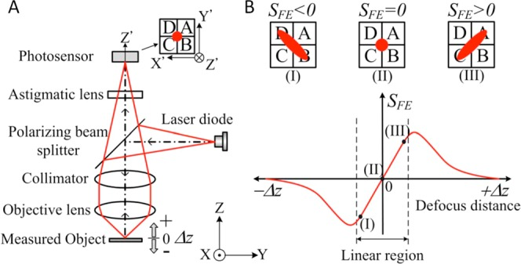

# Lithography Stepper

  

*(Currently in the early research phase)*

Our goal is to build a precision optical system for photolithography pattern transfer. This stepper will allow us to project and step-repeat mask patterns onto photoresist-coated wafers, paving the way for smaller feature sizes and more complex integrated circuits than simple contact lithography allows.

More details, build logs, and BOM will be updated here as the project moves into the prototyping phase.
