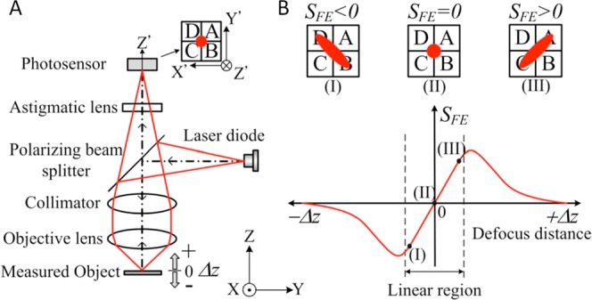

# Lithography Stepper

  

*(Currently in the early research phase)*

Our goal is to build a precision optical system for photolithography pattern transfer. This stepper will allow us to project and step-repeat mask patterns onto photoresist-coated wafers, paving the way for smaller feature sizes and more complex integrated circuits than simple contact lithography allows.

> New to the optics? [Stepper optics, from zero](projects/stepper/optics.md) builds up every idea used on this page, one step at a time, with interactive diagrams.

## How a DMD steers light

A DMD (digital micromirror device) is a chip covered in tiny mirrors, one per pixel. Each mirror tilts to one of two resting angles, ON or OFF. The ON angle sends light into the projection lens and the pixel is bright. The OFF angle sends light into an absorber and the pixel is dark. That is how the stepper turns a digital mask into a pattern of light.

### Tilt doubling

Tilting a mirror by $\alpha$ turns the reflected beam by $2\alpha$. For a DMD whose mirrors rest at $\alpha = \pm 17^\circ$, the illumination is brought in at $2 \times 17^\circ = 34^\circ$ from the chip's normal. The reflected beam's centre is then at

$$
\theta_\text{out} = 2\alpha - 34^\circ
$$

| Mirror state | Tilt $\alpha$ | Reflected beam $2\alpha - 34^\circ$ | Where it goes |
|---|---|---|---|
| ON | $+17^\circ$ | $34^\circ - 34^\circ = \mathbf{0^\circ}$ | Straight out along the normal, into the projection lens |
| Flat | $0^\circ$ | $\mathbf{-34^\circ}$ | Off to the side, missing both the lens and the absorber |
| OFF | $-17^\circ$ | $-34^\circ - 34^\circ = \mathbf{-68^\circ}$ | Into a black absorber inside the module |

### The TIR prism

The illumination comes in $34^\circ$ off the normal, while the image leaves straight up the normal. Both paths share the space right in front of the chip, so something has to bring the light in without blocking the way out. That is the job of a TIR (total internal reflection) prism.

When light inside glass meets air, it bends away from the normal. Snell's law gives the angle in the air:

$$
n_\text{glass} \sin\theta_\text{glass} = n_\text{air} \sin\theta_\text{air}
$$

Past a certain angle, the critical angle, $\sin\theta_\text{air}$ would have to be greater than 1. No light gets out, and 100% of it reflects. For ordinary optical glass (BK7, $n \approx 1.517$):

$$
\theta_c = \arcsin\frac{n_\text{air}}{n_\text{glass}} = \arcsin\frac{1}{1.517} \approx 41^\circ
$$

A TIR prism is two glass prisms with a thin air gap between them.

- **Illumination in.** The illumination hits the gap steeper than $41^\circ$, so the gap acts as a perfect mirror and reflects it down onto the DMD.
- **Image out.** The light coming back up from ON mirrors hits the same gap closer to perpendicular, below $41^\circ$, so it passes straight through toward the output.

One component both folds the illumination in and lets the image out. Some DLP modules use a variant of this design, but the principle is the same.

  

### Try it

Move the sliders to see both effects. The calculations update as you go.

<iframe class="hf-widget" src="widgets/dmd-tir.html" title="Interactive DMD mirror and TIR prism" loading="lazy"></iframe>

More details, build logs, and BOM will be updated here as the project moves into the prototyping phase.
