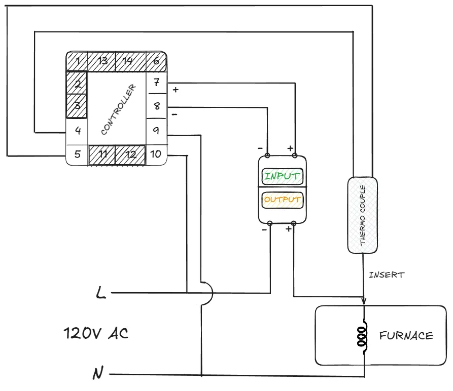
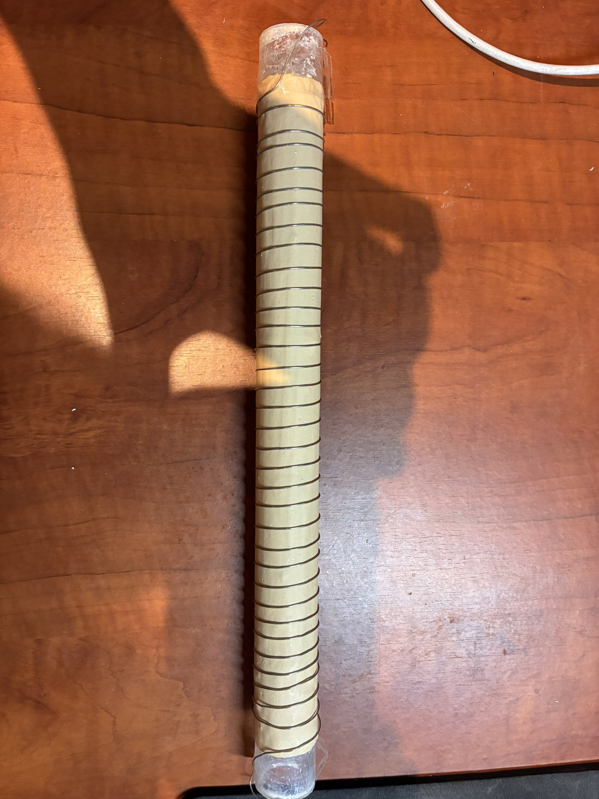
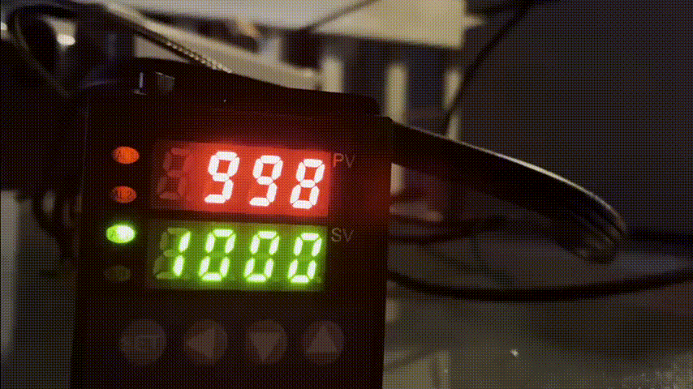

# Custom Tube Furnace Build

  

This outlines the comprehensive design, engineering considerations, and step-by-step build process of our high-temperature tube furnace. As the backbone of our semiconductor fabrication line, this furnace safely reaches and sustains temperatures between 900°C and 1200°C. It is critically utilized for thermal oxidation of silicon wafers and driving-in of dopants into the substrate lattice.

## Engineering & Design Constraints
- **Thermal Capacity:** Must reliably hit 1000°C+ and maintain precision holding temperatures without significant thermal drift.
- **Ramping Profiles:** Requires programmable thermal ramping (e.g., 20°C/minute) to prevent catastrophic thermal shock and stress fracturing of the quartz chamber or silicon substrates.
- **Operator Safety:** Demands robust thermal insulation and electrical isolation to keep the exterior chassis safe to the touch and prevent high-power arcing.

## Comprehensive Bill of Materials (BOM)
* **Heating Element:** Nichrome wire - 0.65mm (22 AWG) (chosen for its high resistance and stability at elevated temperatures).
* **Process Chamber:** Quartz tube - 5/8" OD, 12" Long (transparent to IR, capable of withstanding >1200°C).
* **Chassis / Enclosure:** Carbon steel box.
* **Controller Unit:** Programmable digital PID controller with Ramp & Soak capability.
* **Thermal Sensor:** Type K Thermocouple rated for extreme temperatures.
* **Power Switching:** Solid State Relay (SSR, 40A) coupled with a large aluminum heatsink.
* **Thermal Insulation:** Ceramic Fiber Blanket (>2600°F rating) and rigid Ceramic Fiber Insulation Board.
* **Electrical Wiring:** 12 AWG stranded wire (Main Power), 12 AWG High-Temp Silicone Wire (Internal Routing), 99.9% Pure Copper Wire for interconnects.
* **Hardware & Connectors:** Spade terminals (10-12 AWG), Wago 222 (8-12 AWG).
* **High-Temp Adhesives:** Sodium Silicate Firebrick Refractory Cement, J-B Weld Original.
* **Tapes:** Polyimide (Kapton) High-Temperature Resistant Tape.

## Detailed Build Process

### 1. Enclosure Preparation & Modification
To begin, the carbon steel chassis must be modified to securely house the quartz tube, display panels, and power sockets. Precise hole saws and metal cutting tools are used to cut through the chassis. The structural integrity of the box must be maintained to safely support the heavy insulation and internal components.

  

### 2. Quartz Chamber & Heating Element Assembly
The core heating mechanism relies on nichrome wire acting as a resistive heater.
- **Winding:** Carefully and evenly wind the 22 AWG nichrome wire around the exterior of the quartz tube. Uniform spacing is critical; uneven winding will result in dangerous hot spots and unequal thermal distribution across the wafer.
- **Securing:** Once wound, apply multiple thin layers of Sodium Silicate refractory cement over the nichrome wire to secure it permanently to the quartz. 
- **Curing:** Allow the cement to cure fully according to the manufacturer's specifications before applying any heat.

  
  

### 3. Thermal Insulation Pack-out
Proper insulation is vital to achieve the high temperatures required without melting the internal circuitry or burning the operator.
- **Packing:** Fill the empty voids between the cemented quartz tube and the inner walls of the steel housing with layers of ceramic fiber blanket. 
- **Structural Insulation:** Use rigid ceramic fiber boards to create thermal barriers between the heating chamber and the electronics compartment housing the PID and SSR.

  

### 4. Electrical Routing & Safety Isolation
Operating at mains voltage with high amperage running through exposed nichrome wire presents serious electrical hazards.
- **Grounding:** The carbon steel enclosure MUST be firmly bonded to the Earth/Protective Earth (PE) line to protect against live wire faults.
- **High-Temperature Isolation:** Ceramic tubing or high-grade silicone sleeves must be used anywhere the heating element's leads pass through metal bulkheads to prevent arcing and short circuits.
- **Switching:** Wire the main heating power loop through the 40A SSR. Ensure the SSR is mounted securely to its heatsink, ideally with active airflow, as it will generate significant heat during the ramping phase.

### 5. PID Controller Programming & Tuning
The "brain" of the furnace is the programmable PID controller. It uses a low-voltage control signal to pulse the SSR, modulating high VAC power based on real-time feedback from the interior Type K thermocouple.
- **Tuning:** Modern PID controllers have auto-tune functions which should be run at ~500°C to allow the controller to learn the thermal mass and response curve of your specific build.
- **Process Profiles:** To prevent thermal shock (which can shatter both the quartz tube and the silicon wafers), program a ramp rate of roughly 20°C per minute up to the target temperature (e.g., 1000°C), followed by the required soak duration.

  
  

